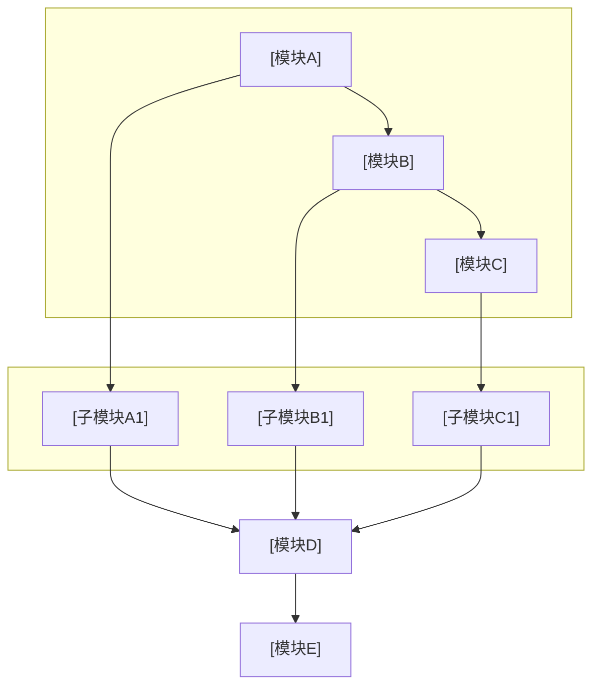

# 专利交底书模版参考（脱敏版）

本文档为技术交底书格式与章节要点参考，内容已脱敏，主用于工程方法、软件系统、数据处理、控制测算、工程仿真/测算工具类中国发明专利。结构类内容仅作为有限辅助附录，由 `disclosure_builder.md` 引用。

---

## 文档头部

```markdown
# 技术交底书

**案件名称**：[待填写]一种XXX方法及系统

**技术联系人**：
- 姓名：[待填写]
- 电话：[待填写]
- 邮箱：[待填写]

**专利类型**：发明

---

## 注意事项

（1）交底书应使代理人能看懂，尤其是背景技术和详细技术方案，一定要写得全面、清楚、完整；
（2）技术的公开程度，应以本领域普通技术人员不需付出创造性劳动即可进行实施为准。
（3）在与代理人沟通时，对于代理人咨询的技术问题，应给予回答并认真讲解，并且按要求及时正确地补充相应技术材料。
```

在用户产出目录保存时，**`.md` / `.docx` 主文件名**应为 **`{案件名称规范化}_{YYYYMMDDHHmmss}`**（占位去掉、非法字符、过长截断及时间戳规则见 `disclosure_builder.md` **§7.3**，**凡交付均须时间戳**），避免与标题无关的固定名。

---

## 一、技术背景与现有技术

### 1.1 现有技术

- 检索渠道、链接格式与禁止事项以 Step 5 **`prior_art_search.md`** 为准（不在此重复）。
- **检索说明**（建议置于 1.1 开头）：写**公开数据库名称**与**检索词**；**勿**写 `cnipa_epub_search.py` 等脚本名或「查新降级」等流程用语（见 **`prior_art_search.md`「1.1 检索说明写法」**）
- 按**技术方向**分类列举（如：单标签方法、多标签方法、聚类策略等）
- 每条现有技术需包含：专利号 / 文献标识、申请方（或来源机构）、技术方案、应用场景、**局限性**、**来源状态（必填）**；已核验时写稳定公开 URL，未核验时写待复核说明。
  - **国知局 `abstract`**：若 Step 5 JSON 含 **`abstract`**，该条「技术方案」等叙述**必须先充分理解摘要后**再概括（见 **`prior_art_search.md`**）；交底书正文勿大段粘贴官方摘要全文。
  - **URL 要求**：与 `prior_art_search.md` 一致——只有本轮实际打开、有效且与著录项一致的公开页面才可写为稳定 URL；**禁止虚构链接**，也禁止把 CNIPA EPUB 二维码/提示路径、壹专利/高数图学校远程访问 URL 或商业库会话 URL 写成已核验 URL。
  - **商业库内容核验**：壹专利 / 高数图可写为内部内容核验状态（如 `commercial_db_content_checked`），但不得作为公开引用 URL；正式公开引用仍以 CNIPA PSS、中国专利公布公告、Google Patents、Espacenet、WIPO 等公开来源闭环为准。
  - **正文呈现建议**：在每条方向下可用「**来源状态 / 来源链接 / 待复核**：…」单独一行，或表格增列对应列。
- 结尾总结：检索总结、**本发明与现有技术的本质区别**

### 1.2 现有技术存在的缺点

- 分点列举，与 1.1 的局限性呼应
- 突出**核心缺陷**：现有技术无法解决的问题

---

## 二、本发明所要解决的技术问题

- 对应一中的缺点，逐条说明本发明的解决思路
- 简明扼要，为第三章详细方案做铺垫

---

## 三、技术方案详细阐述

### 3.1 背景

- 应用场景的通用描述（脱敏：用分类A/B/C、场景X等）
- 本发明针对的问题与核心创新点概述
- 若有人工环节，说明前提条件（如：样本需具有可区分显著特征）

### 3.2 系统框图

- 使用 **fenced mermaid**（推荐 `flowchart TB` / `LR` + `subgraph` 分层）；模块名抽象通用，避免业务术语
- 定稿交付前经 **`tools/mermaid_render.py`** 转为 PNG 并**默认**生成 Word；**不需要**再附 ASCII 文字框图（Word 中以图为准）
- 布局宜层次清晰；复杂时可拆多张 mermaid 图

**mermaid 系统框图模版**（替换标题与模块名、连线；与 3.4 相同为 `` ```mermaid`` 围栏）：



### 3.3 模块功能说明

**重点**：各模块的**作用**和**模块间关联关系**，专利不强调输入输出。

- 作用：该模块在整体方案中的角色
- 关联关系：上下游依赖、数据流/控制流、闭环关系

### 3.4 系统流程说明

#### 流程图

- 使用 **fenced mermaid** 代码块；**不要** ASCII 文字/箭头流程图。
- 定稿交付前用仓库 **`tools/mermaid_render.py`**（本地 `mmdc`）转为 PNG 并**默认**生成 Word；失败时按终端提示用 **`md_to_docx.py`** 手动转换。

#### 流程说明

- 用文字简要说明各步骤或与图中节点的对应关系（**不替代**流程图图示）
- 流程涉及算法、评分、约束或形式化变量时，在 **3.4.1** 集中给出符号定义与主公式；须遵守 **`disclosure_builder.md` §7.7**

### 3.4.1 符号与公式

**撰写顺序**：先建立或核对 **formula manifest** → 再写 **符号与变量定义** → 再写 **核心公式**（含式 (1)）→ 再文字解释与流程衔接。复杂公式较多时，可复制仓库 **`templates/patent_formula_manifest.yaml`** 作为清单模板。

#### 符号表示例（Markdown 正文可直接采用）

```markdown
#### （1）任务侧符号

| 符号 | 含义 | 下标/量纲 |
|------|------|-----------|
| \(i\) | 任务索引 | \(i=1,\ldots,N\) |
| \(b_{i,\mathrm{cpu}}\) | 任务 \(i\) 的 CPU 需求权重 | 无量纲，\(b_{i,\mathrm{cpu}}>0\) |
| \(b_{i,\mathrm{mem}}\) | 任务 \(i\) 的内存需求权重 | 同上 |

#### （2）节点侧符号

| 符号 | 含义 | 下标/量纲 |
|------|------|-----------|
| \(j\) | 计算节点索引 | \(j=1,\ldots,M\) |
| \(a_{j,\mathrm{cpu}}\) | 节点 \(j\) 的 CPU 资源饱和度 | 无量纲，\(a_{j,\mathrm{cpu}}\le 0\) 表示有余量 |
```

若符号表较复杂，优先使用五列表，避免窄表格里残留未转换的内联 LaTeX：

```markdown
| symbol_text | latex | 含义 | 单位/取值 | 来源 |
|-------------|-------|------|-----------|------|
| B_s,t | \(B_{s,t}\) | 配置 s 在小时 t 末的储能能量状态 | kWh | 台账计算 |
| f_s | \(f_s\) | 自用电仍需缴纳的单位费用 | 元/kWh | 经济参数 |
```

表格中的 `latex` 列必须走同一公式转换链路；不得出现未转换的 `\( ... \)`、`frac{}`、`mathrm{}` 残留。若符号过长，宁可放在表格下方用单独公式展示。

#### 公式正/反例（体例必遵）

| 场景 | ✅ 推荐 | ❌ 避免 |
|------|---------|---------|
| CPU 维度权重 | \(b_{i,\mathrm{cpu}}\) | \(b_i^{cpu}\)（上标易被读作幂次） |
| 节点饱和度 | \(a_{j,\mathrm{cpu}} \le 0\) | \(a_j^{cpu} \le 0\) |
| 多维度并列 | \(b_{i,\mathrm{cpu}},\, b_{i,\mathrm{mem}}\) | \(b_i^{cpu}, b_i^{mem}\) |
| 块级主公式 | \[ M_{ij} = \alpha b_{i,\mathrm{cpu}} + \beta a_{j,\mathrm{cpu}} \tag{1} \] 单行 | 块内多行 `\\` 换行堆叠（渲染易失败） |
| 逻辑连接 | 公式外写「且 \(a_{j,\mathrm{mem}}\le 0\)」 | 公式内 `\text{且}` |
| 分式 | \(\frac{E_{s,t,\mathrm{dis}}}{\eta_{\mathrm{dis}}}\) | `frac{E}{eta}` 或截图 |
| 编号 | `\tag{1}` + 工具结构化排版 | 公式后手敲很多空格再写 `(1)` |

**行内/块级分隔符**：全文统一 `\(...\)` / `\[...\]` **或** `$...$` / `$$...$$` 二选一；与 **`disclosure_builder.md` §7.7** 一致。

**Word 交付要求**：`.docx` 中上述符号和公式应为可编辑公式（OMML），不要把公式做成图片，也不要把 `B_{s,t}^{tot}` 等符号用反引号或等宽代码样式输出。生成后须运行 `tools/qa_docx_math.py`；含 manifest 时使用 `--manifest` 检查编号、分式和上下标结构。

### 3.5 关键技术参数

- 置信度/阈值类：含义、取值范围
- 算法参数：公式、约束条件
- 参数表须设 **「符号」列**，与 **3.4.1 符号表逐字同形**（勿在 3.5 改用 `^{cpu}` 而上文用下标）
- 确保与正文公式、实施例数值一致

---

## 四、与现有技术相比的优点

- 先概括性观点，再分点详述
- 与第二章解决的问题、第五章保护点呼应
- 技术细节以第三章为准，本章以论点为主

---

## 五、技术关键点和欲保护点

- 列出核心创新点，每点简明定义
- 详细技术方案引用第三章（如「具体实现见 3.4.1」）
- 避免与第三章重复大段技术细节

### 权利要求书默认结构（方法 + 系统 + 设备 + 存储介质）

主流程默认按四客体保护组合组织第五章保护点，实际申请文件仍由代理人根据查新和审查口径调整。

```markdown
#### 独立权利要求 1：方法

一种[技术领域]的[方法名称]，其特征在于，包括：
S1，获取[工程数据/运行数据/图像数据/文档数据]；
S2，对所述数据进行[清洗/归一化/特征提取/约束计算/候选生成]；
S3，基于[技术规则、模型、阈值或约束关系]得到[中间结果]；
S4，根据所述中间结果生成[控制指令/识别结果/评估结果/校核结果]。

#### 从属权利要求 2-N：方法细化

围绕步骤、参数范围、判断条件、异常处理、边界样本、数据结构或技术效果逐层细化。

#### 独立权利要求 N+1：系统/装置

一种[系统名称]，包括：
- [模块 A]，用于执行 S1 对应的数据获取或预处理；
- [模块 B]，用于执行 S2/S3 对应的处理逻辑；
- [模块 C]，用于执行 S4 对应的输出、控制或校核；
其中，各模块之间通过[数据流/控制流/约束关系]协同，以实现[技术效果]。

#### 电子设备

一种电子设备，包括处理器和存储器，所述存储器存储有计算机程序，所述处理器执行所述计算机程序时实现上述方法的步骤。

#### 计算机可读存储介质

一种计算机可读存储介质，其上存储有计算机程序，所述计算机程序被处理器执行时实现上述方法的步骤。
```

**注意**：不要把“提高管理效率”“自动生成报告”等商业或办公效果写成核心技术效果；应写成数据处理准确性、工程评估稳定性、控制策略约束满足率、识别准确率、错误率降低、计算耗时降低等可技术化验证的效果。

---

## 六、其它

### 实施例

- 应用场景（脱敏）
- 已知类别、无标签数据规模（脱敏）
- 系统流程简述
- **技术效果**：量化或定性说明
- **参数设置示例**：注明「不作为权利要求限制」

---

---

## 附录 A：结构有限辅助三、技术方案详细阐述（结构类模版）

> 仅在 `intake.md` Q1.5 B 路线生效时引用。本附录提供文字组织、附图编号和结构权利要求格式参考；不用于结构类专利点挖掘或创造性评估，交付状态最高 WARN。

### 3.1 技术方案概述

- 用1-2段概括发明的核心思路：本发明要解决什么结构问题、采用什么结构方案
- 不展开具体部件细节（后面各节展开）
- 示例：「本发明在传统[产品名]的[已知结构]基础上，增设[创新结构部件]，通过[结构关系/位移控制/几何约束]实现[技术效果]。」

### 3.2 结构附图及部件编号说明

**附图清单**（按实际附图编号填写）：

```markdown
| 图号 | 标题 | 视角/类型 |
|------|------|----------|
| 图1 | [产品名]正常工作状态剖面图 | 纵向剖视 |
| 图2 | [产品名][状态二]状态剖面图 | 纵向剖视 |
| 图3 | [产品名][状态三]状态剖面图 | 纵向剖视 |
| 图4 | [产品名][终态]状态剖面图 | 纵向剖视 |
| 图5 | [关键部件]局部放大图 | 局部放大 |
| 图6 | [另一关键部件]局部放大图 | 局部放大 |
| 图7 | [动作/位移]顺序示意图 | 原理图 |
```

**统一编号表**：

```markdown
| 编号 | 名称 | 简要说明 |
|------|------|---------|
| 1 | [部件名称] | [一句话描述形状/位置] |
| 2 | [部件名称] | [一句话描述形状/位置] |
| ... | ... | ... |
```

**编号规则**：
- 阿拉伯数字顺序编号，主要结构件从 1 开始
- 关键间隙、路径等非实体特征可编号（如「11-主接触微间隙」）
- 同一部件在所有附图中编号必须一致
- 文中引用格式：「部件名称 编号」（如「插针导体 3」），**不加括号**

### 3.3 各部件结构与功能说明

**撰写模式**：逐部件说明，每个部件包含以下要素（按此顺序）：

1. **形状与构造**：「[部件名称] [编号] 为[形状描述]，具有[构造特征]」
2. **材料**（如有必要）：「采用[材料类型]制成」
3. **连接关系**：「[固定方式]于[相邻部件名称] [编号] 的[位置]」
4. **位置关系**：「位于[参照部件] [编号] 的[方位]，与[另一部件] [编号] 之间形成[间距/间隙/配合关系]」

**正/反例**：

| ✅ 结构特征描述（推荐） | ❌ 功能性描述（避免） |
|------------------------|---------------------|
| 旁路接触件 6 为弧形弹性导电片，一端焊接固定于插针导体 3 根部 | 旁路件用于在主接触失效时提供等电位保护 |
| 绝缘隔离件 7 为环形绝缘舌，套设于插针导体 3 外周，轴向可滑动 | 绝缘件用于阻断电弧路径 |
| 限位肩 15 为插针导体 3 外表面的环形凸台，轴向高度为 h | 限位件用于限制部件的运动范围 |

### 3.4 工作状态/动作过程说明

**撰写模式**：按状态/工位分段，每段对应附图：

```markdown
#### 状态一：[状态名称]（参见图1）

[描述该状态下各部件的位置关系和接触状态]

#### 状态二：[状态名称]（参见图2）

当[触发条件]时，[部件A] [编号] 与 [部件B] [编号] 之间发生[位移/分离/接触变化]。
此时，[部件C] [编号] 由于[结构约束]仍保持[状态]，使得[技术效果]。

#### 状态三：……
```

**技术闭环检查**：从状态一到终态，每一步的因果关系必须连续，不得出现「后续步骤的触发条件在前一步骤中未建立」的断裂。

### 3.5 关键结构参数与设计约束

```markdown
| 参数 | 符号 | 含义 | 约束关系/取值 |
|------|------|------|-------------|
| 主接触行程 | L_m | 主接触对从完全插合到完全分离的轴向位移 | 由连接器规格决定 |
| 旁路接触行程 | L_bp | 旁路接触件的有效接触行程 | L_bp > L_m + δ_safe |
| 安全裕度 | δ_safe | 绝缘介入完成所需的额外行程 | δ_safe ≥ [设计值] |
```

### 结构有限辅助五、技术关键点和欲保护点

结构类专利的保护点应以**结构特征**为核心，辅以**位置关系**和**连接方式**：

- 每个保护点应写成接近权利要求的形式（主语+结构特征+位置/连接关系）
- 保护点之间应有层次：核心结构创新 → 辅助结构 → 参数/材料 → 方法步骤
- 引用第三章具体部件编号和附图

### 结构有限辅助六、具体实施方式

- **实施例一（主实施例）**：结合图1-图N逐状态描述，与§3.4呼应但更具体
- **实施例二/三（变型）**：替代形态（如不同材料、不同结构形式），说明与主实施例的区别
- **技术效果**：量化或定性说明
- **参数设置示例**：如有具体数值，注明来源和「本实施例参数仅为说明性示例，不作为权利要求限制」

## 脱敏检查表

| 检查项 | 脱敏方式 |
|--------|----------|
| 业务/行业名称 | 抽象为通用描述 |
| 具体分类标签 | 分类A、分类B、分类C 等 |
| 具体数值 | 用「一定规模」「预设值」等 |
| 公司/产品名 | 删除或「某系统」 |

---

## 交付正文禁忌（勿写入交底书）

- **禁止**在全文任意位置（尤其**文末**）加入技能仓库、示例仓库、`patent-unveil-review`、`patent-disclosure-skill`、`examples/` 路径、「教学/虚构示例」「不构成法律或技术承诺」等**元脚注**；交付物视为正式技术交底书文稿，**止于业务章节**。

## 公式与参数一致性检查

- 全文公式表述统一（如：置信度权重、密度调整系数）
- **符号体例**：资源维度用下标 `_{\mathrm{cpu}}` 等，**无** `^{cpu}`/`^{mem}` 类上标维度写法
- **符号表完整**：3.4.1 已定义符号；式 (1) 及后文每个符号均在表中出现；**无**同一字母多义
- **公式正确性与逻辑**：各式无笔误；不等式方向与文字一致；公式与 3.4 流程/3.3 模块可互推；边界情形不矛盾
- **跨节同形**：3.4.1、3.5「符号」列、第六章实施例与正文公式 **逐字一致**
- 阈值范围一致（如 0.5–1.5、0.8–1.2）
- 参数命名统一（避免同义不同名混用）
- LaTeX 分隔符全文统一（`\(...\)`/`\[...\]` 或 `$`/`$$` 二选一）
- 实施例数值与 3.5 节对应
